# pands-project2021 - Iris Dataset

# Author : Michelle O'Connor (Student ID : G00398975)

# Table of contents
1. [Project Introduction](#project)
    1. [Project Outline](#projectoutline)
    2. [Python Programs used in Project](#PythonProgramsusedinProject)
2. [Iris Dataset](#irisdataset)
    1. [History of Iris Dataset](#historyofirisdataset)
    2. [Use of Iris Dataset](#useofirisdataset)
3. [Loading and understanding the Iris dataset](#loadingandunderstandingtheirisdataset)
    1. [Loading the dataset](#loadingthedataset)
    2. [Understanding the dataset](#understandingthedataset)
    3. [Initial Dataset Analysis](#initialdatasetanalysis)
4. [Data Visualisation](#datavisualisaton)
    1. [Univariate & Bivariate Analysis](#univariateanalysis)
        1. [Historgrams](#histograms)
        1. [Boxplots](#boxplots)
        1. [Violinplots](#violinplots)
        1. [Univariate & Bivariate Analysis](#univariateanalysis)
    2. [Multivariate Analysis](#multivariateanalysis)
        1. [Scatterplot (Pairsplot)](#scatterplot)
        1. [Correlation and Heatmaps](#correlationandHeatmaps)
        1. [Multivariate Analysis](#multivariateanalysis)
5. [Machine Learning](#machinelearning)
    1. [Train and Validate the data (Machine Learning)](#trainandvalidatethedata)
        1. [Step 1 - Split the Datset](#splitthedataset)
        1. [Step 2 - Training and Testing Dataset shape](#trainandtest)
        1. [Step 3 - Select an algorithm](#selectanalgorithm)
        1. [Step 4 - Pass the training set to the algorithm](#passthetrainingset)
        1. [Step 5 - Predict Species](#spredictspecies)
        1. [Step 6 - Check model accuracy](#scheckmodelaccuracy)
        1. [Step 7 - Compare to other algorithms](#comparetootheralgorithms)
        1. [Step 8 - Final model selection](#finalmodelselection)  
6. [Project Conclusion](#projectconclusion)     
7. [References](#references)

## Project Introduction  

### Project Outline   

The 2021 Programming and Scripting project is based on the well-known Fisher's Iris Dataset.  
The project task was to investigate, analyse and present my findings on the dataset using python.       

The following files are my project submission:
1. README file  
2. Analysis.py (python script file) 
3. Iris dataset (iris.csv and irisoriginal.csv)   
4. Variable Summary txt file  
5. Plots Images folder
    - Features Histogram
    - Petal Length
    - Petal Width 
    - Sepal Length 
    - Sepal Width 
    - Box Plot 
    - Violin Plot 
    - Pairs Plot 
    - Heatmap  

### Python Programs used in Project 

* Pandas  
    Programming language for data manipulation and analysis. Pandas allows importing data from various file formats such as comma-separated values, JSON, SQL, Microsoft Excel. Pandas allows various data manipulation operations such as merging, reshaping, selecting. 

* NumPy   
    Python library used for working with arrays, including a large collection of high-level mathematical functions to operate on these arrays. 

* Matplotlib  
    Comprehensive library for creating static, animated, and interactive visualizations in Python  

* Seaborn   
    Python data visualization library based on matplotlib. It provides a high-level interface for drawing attractive and informative statistical graphics 

* Scikit-learn is a machine learning library with tools for predictive data analysis. It features various classification, regression and clustering algorithms and is designed to interoperate with the Python numerical and scientific libraries. 

    - sklearn.model_selection   
        1. StratifiedKFold - shuffles the data, provides train/test indices to split data in train test sets. 
        2. cross_val_score - It takes the features and target , splits into k-folds (which is the cv parameter), fits on the (k-1) folds and evaluates on the last fold. It does this k times, which is why you get k values in your output
        3. train_test_split - used to for splitting data arrays into two subsets: for training data and for testing data

    - sklearn.metrics 
        1. classification_report - used to measure the quality of predictions from a classification algorithm
        2. confusion_matrix - table summary of the number of correct and incorrect predictions made by a classifier
        3. accuracy_score - computes the accuracy   

    - sklearn.algorithms   
        1. LogisticRegression - supervised learning classification algorithm used to predict the probability of a target variable.   
        2. DecisionTreeClassifier - is a 2 step process, a learning (training) step and prediction step. In the learning step, the model is developed based on given training data. In the prediction step, the model is used to predict the response for given data   
        3. KNeighborsClassifier - algorithm that stores all available cases and classifies new cases based on a similarity measure for a defined number of nearest neighbours "K".  
        4. LinearDiscriminantAnalysis - a dimensionality reduction technique, it reduces the number of dimensions (i.e. variables) in a dataset while retaining as much information as possible.  
        5. GaussianNB - used to calculate conditional probability, it assumes that the continuous values associated with each class are distributed according to a normal (or Gaussian) distribution.  
        6. Support Vector Machine (SVM) Algorithm - uses classification algorithms for two-group classification problems. While it can be used for regression, it is mostly used for classification. 

## Iris Dataset  

### History of Iris Dataset    

The Iris flower data set or Fisher's Iris data set is a multivariate data set introduced by the British statistician, eugenicist, and biologist Ronald Fisher in his 1936 paper **__The use of multiple measurements in taxonomic problems__** as an example of linear discriminant analysis. It is sometimes called Anderson's Iris data set because Edgar Anderson collected the data to quantify the morphologic variation of Iris flowers of three related species.     

The Iris dataset consists of the following:

50 samples of 3 different species (total 150 samples):  
    1.Iris setosa   
    2.Iris Virginica  
    3.Iris Veriscolor  

4 variables (features) were measured:    
    1.Length of sepals (cm)  
    2.Width of sepals (cm)   
    3.Length of petals (cm)  
    4.Width of petals (cm)    

Two of the three species were collected in the Gaspé Peninsula "all from the same pasture, and picked on the same day and measured at the same time by the same person with the same apparatus"    

  

### Use of Iris Dataset   

Why is the Iris dataset so well know, this dataset is the “hello world” of Machine Learning.
“Hello World” is often the first program written by people learning to code, the iris dataset is generally the first dataset used as an introduction into Machine Learning.   

Based on the combination of the features (Sepal Lenght, Sepal Width, Petal Length, Petal Width), Fisher developed a linear discriminant model to distinguish the species from each other based on the morphology of their flowers.  

This discriminant function performed well in discriminating between these species, except some overlap between Iris versicolor and Iris virginica. 
The Iris setosa is noticeably different from the other two species. 

Therefore the dataset is often used in data mining, classification and clustering examples and to test algorithms.
 

References

1. https://www.ritchieng.com/machine-learning-iris-dataset/  
2. https://en.wikipedia.org/wiki/Iris_flower_data_set
3. https://towardsdatascience.com/the-iris-dataset-a-little-bit-of-history-and-biology-fb4812f5a7b5  
5. http://www.lac.inpe.br/~rafael.santos/Docs/CAP394/WholeStory-Iris.html

## Loading and understanding the Iris dataset  

### Loading the dataset 

The Iris dataset is widely available on the internet. The dataset is included in R base and Python in the machine learning package Scikit-learn, so that users can access it without having to find a source for it.  

For the analysis stage of this project, I am treating the iris dataset as a dataset that needs to be loaded to show how pandas can be used to import the data from a csv file and to create a dataframe.    
I rename the columns so that they include the measurement type 'cm' is in the title and I rename the class column to species. 

    path = ""
    filenameForIrisData = path + "iris.csv"
    df = pd.read_csv(filenameForIrisData)
    iris_df = df.rename(columns = {"sepallength" : "Sepal_length(cm)", "sepalwidth" : "Sepal_width(cm)",   
    "petallength" : "Petal_length(cm)", "petalwidth" : "Petal_width(cm)", "class" : "species"})

### Understanding the dataset 

The first part of investigating a dataset, starts with an initial understanding of the shape and what elements are included in the dataset. Python has many functions that allow for data analysis and below I use some to perform the analysis. 

* I preview a sample of the data, for example the first 5 rows  
        print(iris_df.head(5))     

    

    
Output 
   
    
         

    
    

This shows the dataset has 5 columns (4 columns of measurements of the flowers, Sepal Length, Sepal Width, Petal Length, Petal Width and 1 column of the Species of the flowers), and an unknown quantity of the rows.
I then build upon this to extract different views of the data:  

* Show the full size (shape) of the dataset.  
        We have 150 samples for the 5 columns    
    
        print(iris_df.shape)   

    

  
Output 
       

        

    
    
        

* Show the number of instances, the number of attributes and if any null values exist in the dataset.  
        We have 150 instances for 5 attributes of which no null values exist.    
    
        print(iris_df.info())   
      
    

  
Output 
   

        

    
      

* Show how many instances the dataset contains by species.  
        The dataset has an equal number of 50 instances for each species.  
           
        print(iris_df.groupby('species').size())     
      
    

  
Output 
   

         

    
      

* Show the basic statistical details of the dataframe (iris dataset).  
        This shows the count, mean, std, min, 25%, 50%, 75%, max information for each feature. 
        
        print(iris_df.describe())   
      
    

  
Output 
   

         
       
    
        

* Show the first 5 rows of each type of species

        print(iris_df[0:5])
        print(iris_df[50:55])
        print(iris_df[100:105])     
       
    

  
Output 
   

              
      
    
      

* Show Duplicate rows

        print(iris_df.duplicated().sum())
        print (iris_df[iris_df.duplicated()])   
       
    

  
Output 
   

    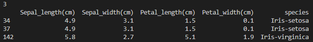          
      
    
      

* Show the summary of each variable by the species    

        print(iris_df.groupby("species").describe())
  

To extract this data into a newly created single text file, we need to make the output in a string format using str. 

        with open("Variable_Summary.txt", "wt") as f:  
        print ("Shape of Data \n", str(iris_df.shape),"\n", file = f)  
        print ("Count by Species \n", str(iris_df.groupby('species').size()),"\n", file = f)  
        print ("Statistical Data by feature \n", str(iris_df.describe()),"\n", file = f)  
        print ("Summary of each feature by species \n",str(iris_df.groupby("species").describe()), "\n", file = f)

### Initial Dataset Analysis   

Summary of the intial findings show a dataset of 50 rows each for 3 different species of the Iris flower, with no null values in the dataset.  
The statisical details of the dataset show that the mean range from 5.84 on the sepal length down to 1.19 on the petal width.     
The 50% for Sepal length and Sepal width are very close to the mean, this indicates a normal distribution as 50% of the results are above the median and 50% are below.   
In contrast for Petal length, its 50% is higher than the median of 3.75. Therefore 50% of the results are above 4.35, and the remaining 50% below 4.35. This indicates the distribution is skewed. 

When I check for duplicates I expected to only see 1 as per Ronald Fisher's dataset but instead it shows 3 duplicates. It is noted on the UCI - Machine learning repository webpage that the dataset on their page differs from the data presented in Fishers article. This highlights the fundamental importance of ensuring you upload the most up to date and accurate dataset.   
I changed my dataset to reflect the correct data and all analysis herein in the project are based on the correct data as listed on Ronald Fisher's article.  

https://www.c-sharpcorner.com/article/a-first-machine-learning-project-in-python-with-iris-dataset/
https://www.c-sharpcorner.com/article/a-first-machine-learning-project-in-python-with-iris-dataset/
https://www.kaggle.com/adityabhat24/iris-data-analysis-and-machine-learning-python
https://towardsdatascience.com/how-to-use-groupby-and-aggregate-functions-in-pandas-for-quick-data-analysis-c19e7ea76367
https://www.geeksforgeeks.org/python-basics-of-pandas-using-iris-dataset/  

## Data Visualisation  

With a basic understanding of the dataset, we move to data visualisation to help us compare and observe trends within the data.  

Python has many visualation options using matplotlib and seaborn libraries. I explore some of these options in my Univariate, Bivariate and Multivariate analysis outlined below. 

### Univariate & Bivariate Analysis   

Univariate analysis is the simplest form of analysing data. “Uni” means “one”, so in other words the data has only one variable. It doesn’t deal with causes or relationships and its major purpose is to describe; it takes data, summarizes that data and finds patterns in the data.   
Bivariate analysis is used to find out if there is a relationship between two different variables. For this part of my analyis, I will treat the species as one variable and the individual features as th other variable.  

#### Historgrams  

Histograms is a classic visualisation tool that show the distribution of the number of observations that fall within in a bin.      

I being start by showing a simple histogram of each of the 4 features. 

The first line of code sets out the layout and size of the visual ouput.   
To build the histogram I outline the source of the data, the x axis source, the colour of the columns and the position in the layout.     

    fig, axs = plt.subplots(2, 2, figsize=(7, 7))
    sns.histplot(data=iris_df, x="Sepal_length(cm)", color="skyblue", ax=axs[0, 0])
    sns.histplot(data=iris_df, x="Sepal_width(cm)", color="olive", ax=axs[0, 1])
    sns.histplot(data=iris_df, x="Petal_length(cm)", color="gold", ax=axs[1, 0])
    sns.histplot(data=iris_df, x="Sepal_width(cm)", color="teal", ax=axs[1, 1])
    plt.savefig("Plot_Images//Features_Histogram.png")
    plt.show()  

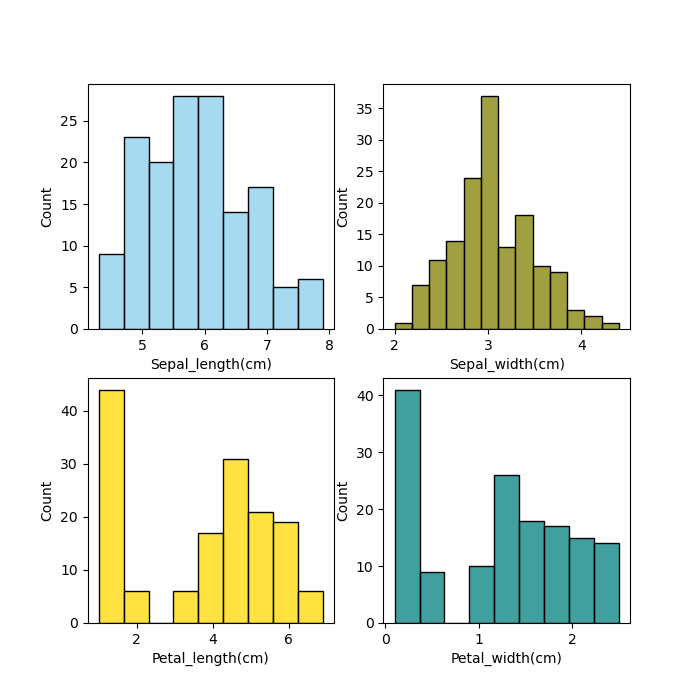 

While Univariate visuals are useful for an overall data group summary, it doesn't help us to analyse by the species.  
I move from Univariate to Bivariate Histograms to bring in the class of species by feature into the visuals. 

FacetGrid within Seaborn is a multi-plot grid to help visualise distribution of a variable.  
The 'hue' option allows a variable that determines the colour of the plot elements, in this case it is species that drives the different colours on the visual.   

    sns.FacetGrid(iris_df,hue="species",height=5).map(sns.histplot,"Petal_length(cm)").add_legend()
    plt.savefig("Plot_Images/Petal_Length.png")
    sns.FacetGrid(iris_df,hue="species",height=5).map(sns.histplot,"Petal_width(cm)").add_legend()
    plt.savefig("Plot_Images/Petal_Width.png")
    sns.FacetGrid(iris_df,hue="species",height=5).map(sns.histplot,"Sepal_length(cm)").add_legend()
    plt.savefig("Plot_Images/Sepal_Length.png")
    sns.FacetGrid(iris_df,hue="species",height=5).map(sns.histplot,"Sepal_width(cm)").add_legend()
    plt.savefig("Plot_Images/Sepal_Width.png")
    plt.show()   

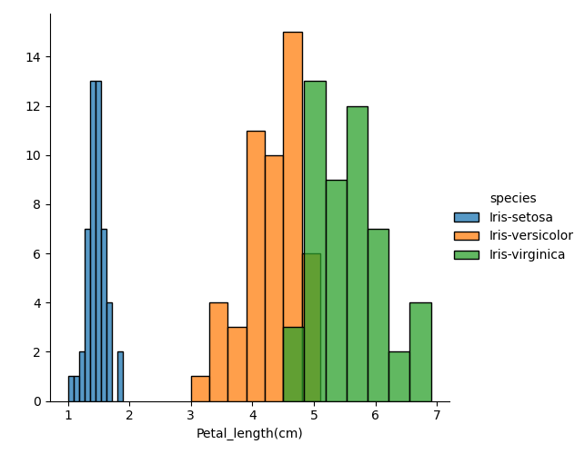 
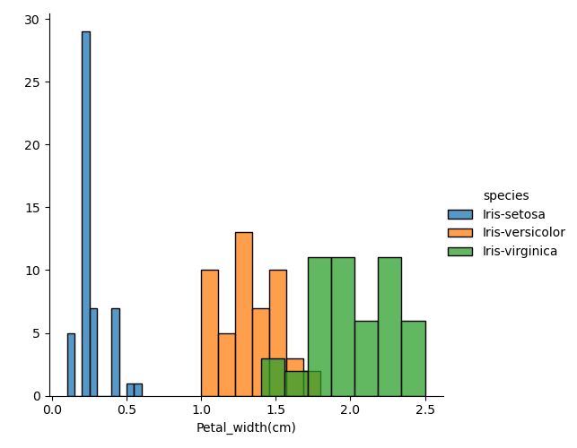 
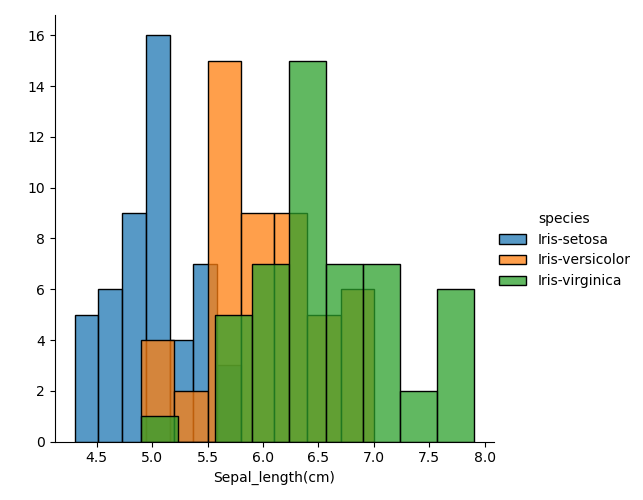   
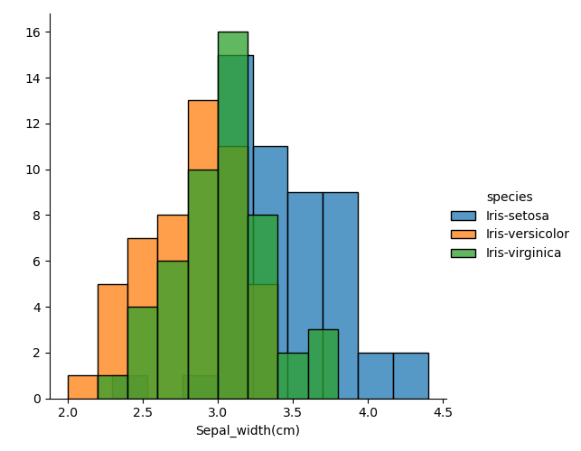   

The outputting plots show that for petal length and petal width we can separate/differeniate the species Setosa from the other 2 species Virginica and Versicolor.    
Using sepal length and sepal width, it is not possible from looking at histogram charts to separate the flowers as the results overlap between all 3 species.   

#### Boxplots  

Boxplot show the range the individual attributes fall into, it represents the minimum, first quartile (25% or lower), median, third quartile (75% or upper) and maximum of the dataset.  
The box on the plot shows between the first (25%) and third quartile (75%) on the range. The horizontal line that goes through the box is the median.  
The top and bottom lines known as 'whiskers' extend from the ends of the box to the minimun and maximum value.    
Any data points past the whiskers (represented by a diamond) are considered as outliers. Outliers are data results that lie an abnormal distance from other values in the dataset.

Using Seaborn library within Python we plot a Boxplot for each variable/feature (4 Boxplots in total). 
To show 4 Boxplots on the one output requires a 2 x 2 (2 columns and 2 rows), therefore subplot(2,2) is required.  
The 3rd value in the subplot indicates where on the output the plot is shown, as follows 1 - Top Left, 2 - Top Right, 3 - Bottom Left, 4 - Bottom Right, 
for example (2,2,3) would show on the bottom left of the output.  
On the plot the x axis is the species type, y axis is the attribute  

    plt.figure(figsize=(15,10)) = set the size of the boxplot 
    plt.subplot(2,2,1)    
    sns.boxplot(x='species',y='Sepal_length(cm)',data=iris_df)
    plt.subplot(2,2,2)    
    sns.boxplot(x='species',y='Sepal_width(cm)',data=iris_df)     
    plt.subplot(2,2,3)    
    sns.boxplot(x='species',y='Petal_length(cm)',data=iris_df)     
    plt.subplot(2,2,4)    
    sns.boxplot(x='species',y='Petal_width(cm)',data=iris_df)
    plt.savefig("Plot_Images/Box_plot.png")
    plt.show()   

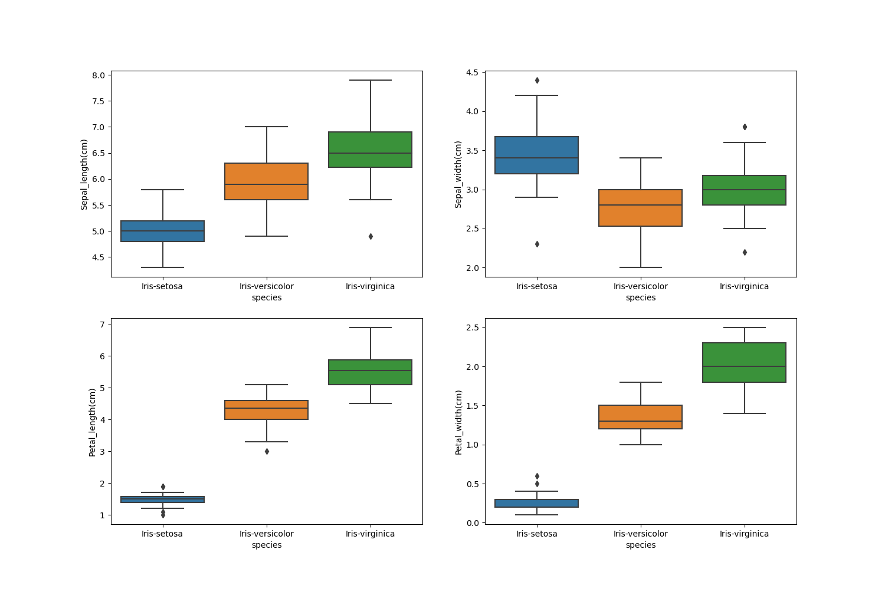    

Analyising the box plots, the sepal length and sepal width data results are close, with some overlap between all 3 species.   
However similiar to the initial view of the dataset and the histograms, the box plots show us that for Iris Setosa the petal length and petal width is visually clearly different from the Veriscolor and Virginica.   
The Iris Setosa petal length and petal width variables/features data do not overlap with the Veriscolor and Virginica, even including the outliers!  
 

#### Violinplots  

The Violinplot groups by species, similar to the boxplot it shows how the length and width vary according to the species.  
However the violinplot show the density of the results, the thinner part shows that there is less occurances whereas the fatter part conveys higher density or high occurences.  

The code for a Violinplot is similar to Boxplot, to have all showing on the one output requires a 2 x 2 (2 columns and 2 rows), therefore subplot(2,2) is required.   
The 3rd value in the subplot indicates where on the output the plot is shown, as follows 1 - Top Left, 2 - Top Right, 3 - Bottom Left, 4 - Bottom Right.  
On the plot the x axis is the species type, y axis is the attribute. 

    plt.figure(figsize=(15,10))
    plt.subplot(2,2,1)
    sns.violinplot(x='species',y='Petal_length(cm)',data=iris_df)
    plt.subplot(2,2,2)
    sns.violinplot(x='species',y='Petal_width(cm)',data=iris_df)
    plt.subplot(2,2,3)
    sns.violinplot(x='species',y='Sepal_length(cm)',data=iris_df)
    plt.subplot(2,2,4)
    sns.violinplot(x='species',y='Sepal_width(cm)',data=iris_df)
    plt.savefig("Plot_Images/Violin_plot.png")
    plt.show()    

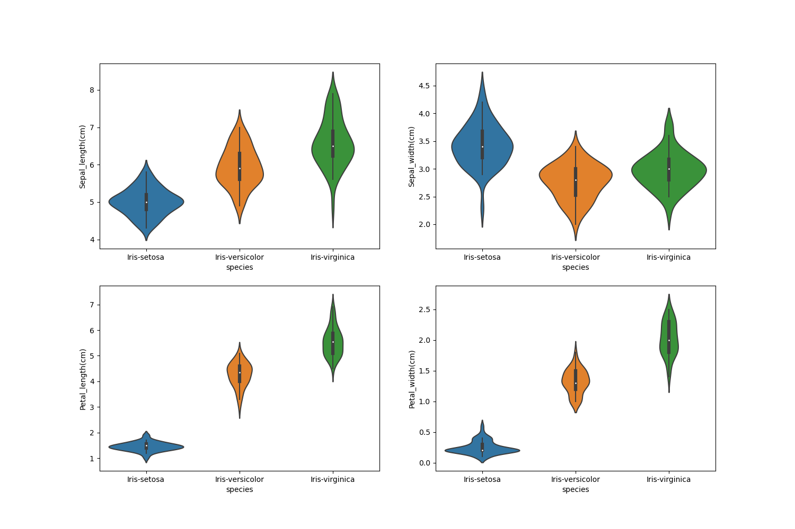       

The Violinplot shows that Iris Virginica has highest median value in petal length, petal width and sepal length when compared against Versicolor and Setosa.  
However, Iris Setosa has the highest sepal width median value.     
The violin plot also indicates that the weight of the Setosa's petal length and petal width are highly concentrated around the median (i.e. they are fatter around the median), where are the Versicolor and Virginica are thinner for both of these features. 

#### Univariate & Bivariate Conclusion   

Summary of all 3 of my analysis (Histograms, Boxplots and Violinplots) show for the Iris Setosa the petal length and petal width is visually clearly different from the Veriscolor and Virginica.   

### Multivariate Analysis     

Multivariate analysis helps us understand the relationships between variables (features) & species better, i.e. which variables contributes a lot in classifying species.  
In my multivariate analysis, I will analyse features against each other by species, to determine if any trends can detected. 

#### Scatterplot (Pairsplot)  

Scatter plot is very useful to analyse the relationship between 2 features on x and y axis.  
A pairs plot gives a scatter plot of different features.    
The Pairsplot produces a matrix of relationships between each variable in your data for an instant visualation and examination of the dataset.  
The Pairsplot shows both distribution of single variables and relationships between two variables.    

In seaborn library within python there is a pairplot function which is very useful to scatter plot all the features at once instead of plotting them individually.  

Each iris species scatters plots are represented in different colours, the 'hue' option allows a variable that determines the colour of the plot elements, in this case it is species that drives the different colours on the visual.   
Diag_kind="kde" determines that the plot of the diagonal subplots, I have chosen a density plot.  

For each pair of variables, we can use a scatter plot to visualize their joint distribution 
    sns.pairplot(iris_df, hue="species", diag_kind="kde")  
    plt.savefig("Plot_Images/Pairsplot.png")  
    plt.show()    

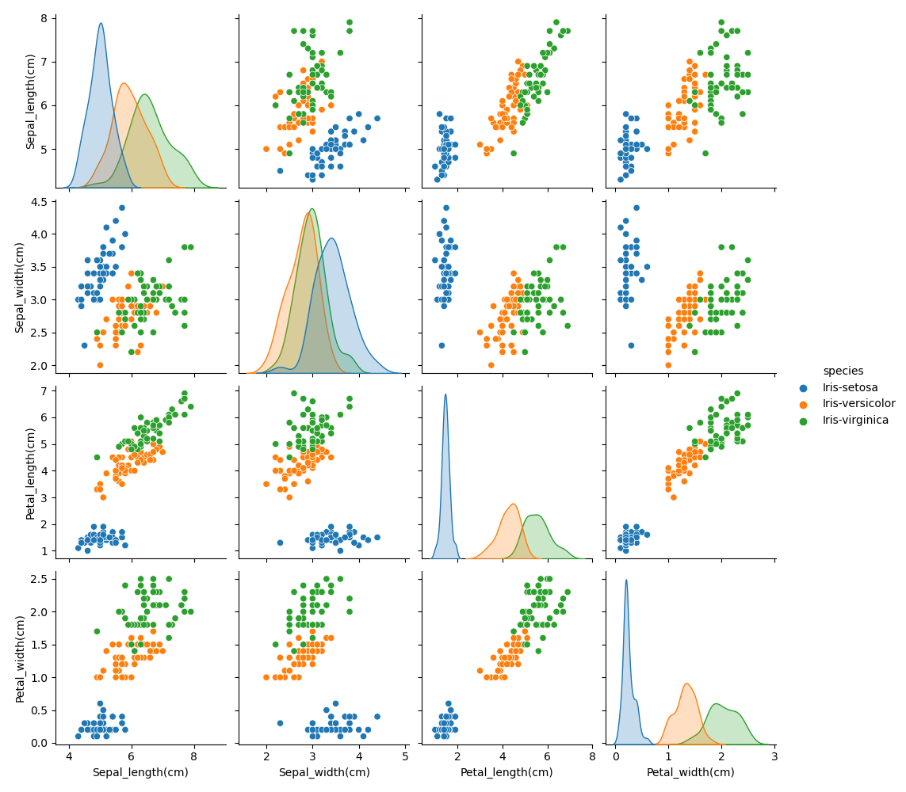       

The plot shows that the Petal length and Petal width are the most effective features to identify the different species of Iris. The species of Virginica and Versicolor cannot be easily separated based on their measurements. 

#### Correlation and Heatmaps  

A Heatmap is used to show correlation. Each square shows the correlation between the variables on each axis.   
Correlation ranges from -1 to +1. Values closer to zero means there is no linear trend between the two variables.    
The closer to 1 the correlation is the more positively correlated they are; that is as one increases so does the other and the closer to 1 the stronger this relationship is.    
A correlation closer to -1 is similar, but instead of both increasing one variable will decrease as the other increases. 

As I plan is to use and train algorithms, the number of features and their correlation plays an important role for this.  
If there are features that are highly correlated, then training an algorithm with all the features will reduce the accuracy.   
The iris dataset has a low number of featues (4) but still we will see the correlation. 

Using the heatmap feature in Seaborn, we show the values on the heatmap by inserting "annot = True" and use cmap to pick the colour palette of my choice.  

    print(iris_df.corr())  

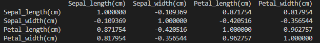   

    plt.figure(figsize=(15,10))
    sns.heatmap(iris_df.corr(), annot = True, cmap = 'rocket') 
    plt.savefig("Plot_Images/Heatmap.png")
    plt.show()

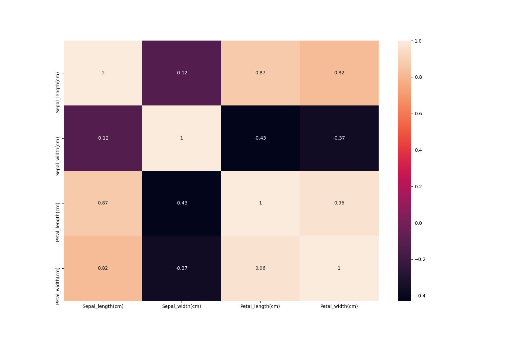   

 
   
The diagonals are all 1 (light in colour) because those squares are correlating each variable to itself (so it's a perfect correlation).  
High positive or negative value (values close to 1 or -1) shows that the features have high correlation, in the iris dataset the petal length and petal width have the highest correlation with a value of 0.96.    
On the opposite end, the sepal width and the sepal length have the lowest correlation with a value of -0.11.

#### Multivariate Conclusion     

Similar to the univariate & bivariate analysis, the Pairsplot shows petal length and petal width to be the best combination of features to determine the species of the flower by their measurements alone. There is clustering in the Versicolor and Virginica species across all features but less so in the petal length and petal width.  

For the heatmap if there are features that are highly correlated, then training an algorithm with all the features will reduce the accuracy.  
We have some features that are highly correlated, in particular the pairings of Sepal length/Petal length, Petal Width/Petal length and Sepal length/Petal Width.  

Therefore if I was given a new sample of data for the 4 features of the iris flower, I could best predict the species visually by using the Petal Width/Petal length dimensions. 
However the next section will cover how Python can predict the species. 

https://www.python-graph-gallery.com/25-histogram-with-several-variables-seaborn
https://stackabuse.com/ultimate-guide-to-heatmaps-in-seaborn-with-python/  
https://www.kaggle.com/ash316/ml-from-scratch-with-iris  
http://www.cse.msu.edu/~ptan/dmbook/tutorials/tutorial3/tutorial3.html
https://www.c-sharpcorner.com/article/a-first-machine-learning-project-in-python-with-iris-dataset/    
https://medium.com/@avulurivenkatasaireddy/exploratory-data-analysis-of-iris-data-set-using-python-823e54110d2d
https://www.kaggle.com/dhruvmak/iris-flower-classification-with-eda  
https://stats.stackexchange.com/questions/392517/how-can-one-interpret-a-heat-map-plot    
 

## Machine Learning        

Knowing that the iris dataset is generally the first dataset used as an introduction into Machine Learning, I was interested to see how this worked. 
Python supports machine learning through the Scikit-learn library. It has the tools for predictive data analysis. It features various classification, regression and clustering algorithms and is designed to interoperate with the Python numerical and scientific libraries.  

### Train and Validate the data (Machine Learning)    

The Iris dataset can be used by a machine learning model to illustrate classification, a method used to determine the type of an object (species in this dataset) by comparison with similar objects that have previously been categorised.   
Once trained on known data, the machine learning model can make a predictive classification by comparing a test object to the output of its training data.

Steps to be followed when applying an algorithm.  
1. Split the dataset into training and testing dataset.  
2. The testing dataset is generally smaller than training one as it will help in training the model better. I have chosen a 75%:25% training:testing split.  
3. Select an algorithm based on the problem (classification or regression). 
4. Pass the training dataset to the algorithm to train it, use the .fit() method.  
5. Then pass the testing data to the trained algorithm to predict the outcome, use the .predict() method.  
6. Check the accuracy by passing the predicted outcome and the actual output to the model.
7. Check against other algorithms.  
8. Final model selection.  

Using the Scikit-learn library, I import the dataset using "sklearn.datasets import load_iris".  

The preliminary step is to define the attributes or input group (i.e. 4 features sepal length, sepal width, petal length, petal width) as X=iris.data and define the target or what we want to predict (species) as y=iris.target.    

    X=iris.data
    y=iris.target  

#### Step 1 - Split the Datset    

My first step was to split the dataset into training and testing dataset, I have chosen a 75%:25% split:  
75% of the data will be training data - X_train, y_train for training the model (X_train is the features input and y_train is the species output)  
25% of the data will be testing data - X_test, y_test for testing the model (X_test is the features input and y_test is the species output)    

    from sklearn.model_selection import train_test_split
    X_train,X_test,y_train,y_test=train_test_split(X,y,test_size=0.25)
  
#### Step 2 - Training and Testing Dataset shape      

To show the shape/size of the train and test data samples:  
X_train is 75% of 150 = 112 rows of data in 4 columns (the 4 features/variables)  
y_train is 75% of 150 = 112 rows of the species column   
X_train is 25% of 150 = 38 rows of data in 4 columns (the 4 features/variables)  
y_train is 25% of 150 = 38 rows of the species column     

    print("X_train shape: {}".format(X_train.shape))
    print("y_train shape: {}".format(y_train.shape))
    print("X_test shape: {}".format(X_test.shape))
    print("y_test shape: {}".format(y_test.shape))     

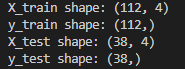   

#### Step 3 - Select an algorithm     

Before selecting an algorithm, I need to decide if it is a classification or regression problem I need to resolve.   

Fundamentally, classification is about predicting a target or class and regression is about predicting a quantity.  
Classification is the problem of predicting a discrete target/class output for an example and regression is the problem of predicting a continuous quantity output for an example. 

Predicting the species of a flower based on input measurements is a classification problem, therefore I select one of the classification algorithms to start train and validate the data.   

I have chosen the k-nearest neighbours (knn) classifier as the algorithm to make a prediction of the species for sample data of one new sample, as this algorithm has been described as easy to implement.    
The KNN algorithm assumes that similar things exist in close proximity, that is similar things are near to each other.   
k is the number of nearest neighbours and is the core deciding factor. I set the K number, the k number can be considered any fixed number k of neighbors in the training.   
The algorithm calculates the distance between the new data or sample point with the training examples.   

The model picks 'k' (as determined by the user) entries in the training data which are closest to the new data point and then is does a majority vote, that is it takes the most common species among those 'k' entries to be the species of the new data point.   
When k=1, the algorithm is know as the nearest neighbour algorithm.    
We can now make a prediction using the majority class among them. For our example, we will use one neighbor (k=1). 

#### Step 4 - Pass the training set to the algorithm   

I now use the fit method of the knn object, to train the algorithm with the training data X_train (containing the training data of the 4 features) and the training output y_train (containing the corresponding species), this builds up our model on the training set.  
We enter sample data (X_new) and show the shape of the data, it is one row (1 sample) with 4 columns of data (the 4 features/variables sepal and petal measurements).   

    knn = KNeighborsClassifier(n_neighbors=1)  
    knn.fit(X_train, y_train)  
    X_new = np.array([[5, 2.9, 1, 0.2]])  
    print("X_new.shape: {}".format(X_new.shape))     

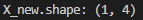   

#### Step 5 - Predict Species    

I now use the predict method of the knn object to predict the species of the sample data X_new and print the outcome. In the iris dataset, it has a species class of 0, also know as the setosa. 

    prediction = knn.predict(X_new)
    print("Prediction: {}".format(prediction))
    print("Predicted target name: {}".format(iris['target_names'][prediction]))    

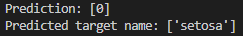   

#### Step 6 - Check model accuracy     

Now that I have a prediction of the species, one question it poses is how can I trust the results of the k nearest neighbours model.  

The test data that was created was not used to build the model, but I do know the correct species for each iris in the test set.   
Therefore, I can make a prediction for each iris in the test data and compare it against its species, so I can know if the model is correctly predicting the species for a given flower.  
To measure how well the model works, I can obtain the accuracy of the number of flowers for which the right species was predicted.  

Using the X_test data containing the testing data (25% of the dataset) of the 4 features, I print out the prediction (y_pred) of the species using only the 4 features.  
And then compare the prediction of the species 'y_pred' to the actual species 'y_test'.   

    y_pred = knn.predict(X_test)
    print("Test set predictions:\n {}".format(y_pred))
    print("Test set score (np.mean): {:.2f}".format(np.mean(y_pred == y_test)))  

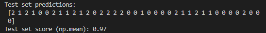 

Another way to do this would be to use the score method of the knn object, which will compute the test set accuracy 

    print("Test set score (knn.score): {:.2f}".format(knn.score(X_test, y_test)))  

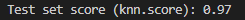   

For this model, the accuracy on the test set is 0.97, which means the model made the right prediction for 97% of flower species.    
We can expect the model to be correct 97% of the time for predicting the species of any new samples.  
This is a high level of accuracy and it means the the K nearest neighbour model is trustworthy.  

While the iris dataset and classification is simple, it is a good example to illustrate how a machine learning problem should be approached and how useful the outcome can be. 
This explains its popularity on being an introduction into machine learning.  

#### Step 7 - Compare to other algorithms    

An additional step that can be done is to spot check other classification algorithms to see their results. 
I will test 6 different popular classification algorithms, the selected algorithms are a good mixture of simple linear (LR and LDA), nonlinear (KNN, CART, NB and SVM) algorithms.  

    models = []
    models.append(('LR', LogisticRegression(solver='liblinear', multi_class='ovr')))
    models.append(('LDA', LinearDiscriminantAnalysis()))
    models.append(('KNN', KNeighborsClassifier()))
    models.append(('CART', DecisionTreeClassifier()))
    models.append(('NB', GaussianNB()))
    models.append(('SVM', SVC(gamma='auto')))

Cross Validation (CV) splits the dataset into a specified number of the smaller sets (number of folds of the data).  
Each model in turn is trained on these smaller sets whith some of the data held back for testing within each set/fold.    
Each model is tested on the data held back for testing (i.e., it is used as a test set to compute a performance measure such as accuracy).   

I set out the parameters of the Cross Validation by selecting the number of folds (10), setting shuffle to True and randon state to 1 to avoid repeat shuffling/splits and overlap of data.    

There is an option to set the scorer object with the scoring parameter, I have set the scoring method to be accuracy to get the count of correct predictions.  
Accruacy score will give the mean % of the number correct results and the standard deviation for this %.
 
    results = []
    names = []
    for name, model in models:
        kfold = StratifiedKFold(n_splits=10, random_state=1, shuffle=True)
        cv_results = cross_val_score(model, X_train, y_train, cv=kfold, scoring='accuracy')
        results.append(cv_results)
        names.append(name)
        print('%s: accuracy %f with a standard deviation of (%f)' % (name, cv_results.mean(), cv_results.std()))

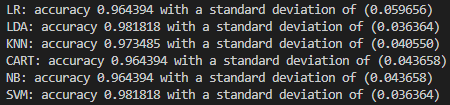   

We can also create a plot of the model evaluation results and compare the spread and the mean accuracy of each model.  
A useful way to compare the samples of results for each algorithm is to create a box and whisker plot for each distribution and compare the distributions.

    plt.boxplot(results, labels=names)
    plt.title('Algorithm Comparison')
    plt.show()    

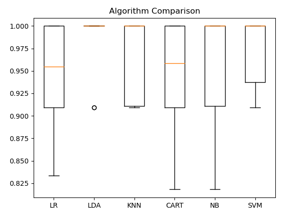   

We can see that the box and whisker plots are squashed at the top of the range, with many evaluations achieving 100% accuracy, and some pushing down into the high 80% accuracies.  

#### Step 8 - Final model selection   

The results in the previous section suggest that the LDA was the most accurate model, I will use this model as the final model.   

Now I want to get an idea of the accuracy of the model on the testing set.  
This will give an independent final check on the accuracy of the best model.  

Similar to Step 4 above, I pass the training set to the LDA algorithm. I fit the model on the entire training dataset and make predictions on the testing dataset.
    lda = LinearDiscriminantAnalysis()
    lda.fit(X_train, y_train)
    LDApredictions = lda.predict(X_test)

I can evaluate the predictions of the testing data (LDApredictions) by comparing them to the expected results (y_test) in the testing set and then calculate classification accuracy, as well as a confusion matrix and a classification report.   

    print(accuracy_score(y_test, LDApredictions))
    print(confusion_matrix(y_test, LDApredictions))
    print(classification_report(y_test, LDApredictions))    

   

I can see that the accuracy is 1.0 or about 100% on the hold out dataset.    
The confusion matrix provides an indication of the errors made.
Finally, the classification report provides a breakdown of each class by precision, recall, f1-score and support showing excellent results (granted the validation dataset was small).  
  

## Project Conclusion      

The initial data analysis shows a relativily small dataset of 50 samples for 3 species with no null values. However when checking for duplicates, it showed I had 3 instead of the expected 1. This highlights the fundamental importance of ensuring you upload the most up to date and accurate dataset. The output you get is only as good and as accurate as the data you put in. 

The Mayplotlib and Seaborn libraries within Python have many features to visually display the data for univariate, bivariate and multivariate analysis. While the Iris dataset is relatively small, these libraries come into their own when dealing with the large datasets that exist in today's world.  
Starting with Univariate and Bivariate visuals, I built up my understanding of the dataset and started to see trends in petal length feature that indicate it would be the best feature to predict a species by.  

The analysis part of this project shows that the species Setosa is visually different from Veriscolor and Virginica.   
The background of the dataset reveals that two of the three species were collected in the Gaspé Peninsula "all from the same pasture, and picked on the same day and measured at the same time by the same person with the same apparatus".   
This poses the question that if Veriscolor and Virginica were picked on the same day with the same apparatus and by the same person, and the Setosa was picked on a different day using a differen apparatus did it influence the outcome as the results of Veriscolor and Virginica are so similar. 
However Ronald Fisher mentions in his paper that the he uses the "measurements of the flowers of fifty plants each of the two species Iris setosa and Iris versicolor, found growing together in the same colony and measured by Dr E. Anderson", my presumption is it was Setosa and Veriscolor that were measured on the same day and thus not affecting the outcome.   

I then moved onto the Multivariate analysis, the Pairs plot showed the best feature combination to predict the species visually is by using the Petal Width/Petal length dimensions. If I had new sample data for the 4 features of the Iris flower, I could best predict the species visually by using these features.  

However since Machine learning and artificial intelligence-based projects are what the future holds, I took the path of using Python to explore machine learning to predict the species.   

Python supports machine learning through its extensive set of libraries especially the Scikit-learn library which I used in my testing.  I did a an 8 step process from training and testing the dataset, using the KNN algorithm to predict the species, checking the accuracy of the KNN model and finished up with checking it against some of the other machine learning algorithms to select the final model to predict species based on the most accurate model which turned out to be LDA (Linear discriminant analysis).  

An interesting real life example of Machine learning is where a computer scientist developed a machine learning system called 'Giraffe' that can play International Master level of chess in 72 hours. It learnt by playing chess against itself. While the system was fed a massive dataset of moves from real chess matches, it used those moves in games it plays against itself, learning which worked in which situation, all the time building up its knowledge base. Fundamentally machine learning is teaching technology to teach itself.   

While the Iris dataset is not on the scale of the chess example above, it is a great example of showing at an introduction level how we can use machine learning programming languages to think like a human brain does.

## References    

1. https://www.c-sharpcorner.com/article/a-first-machine-learning-project-in-python-with-iris-dataset/
3. https://www.kaggle.com/adityabhat24/iris-data-analysis-and-machine-learning-python
4. https://towardsdatascience.com/how-to-use-groupby-and-aggregate-functions-in-pandas-for-quick-data-analysis-c19e7ea76367
5. https://www.geeksforgeeks.org/python-basics-of-pandas-using-iris-dataset/  
6. https://medium.com/gft-engineering/start-to-learn-machine-learning-with-the-iris-flower-classification-challenge-4859a920e5e3
7. https://machinelearningmastery.com/machine-learning-in-python-step-by-step/
8. https://machinelearningmastery.com/make-predictions-scikit-learn/
9. https://kedro.readthedocs.io/en/stable/02_get_started/05_example_project.html
10. https://stackabuse.com/ultimate-guide-to-heatmaps-in-seaborn-with-python/  
11. https://www.kaggle.com/ash316/ml-from-scratch-with-iris  
12. http://www.cse.msu.edu/~ptan/dmbook/tutorials/tutorial3/tutorial3.html
13. https://www.c-sharpcorner.com/article/a-first-machine-learning-project-in-python-with-iris-dataset/    
14. https://medium.com/@avulurivenkatasaireddy/exploratory-data-analysis-of-iris-data-set-using-python-823e54110d2d
15. https://www.kaggle.com/dhruvmak/iris-flower-classification-with-eda  
16. https://stats.stackexchange.com/questions/392517/how-can-one-interpret-a-heat-map-plot     
17. https://qz.com/502325/an-ai-computer-learned-how-to-beat-almost-anyone-at-chess-in-72-hours/  
18. https://scikit-learn.org/stable/modules/cross_validation.html#cross-validation 
19. https://scikit-learn.org/stable/modules/model_evaluation.html#scoring-parameter
