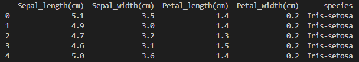
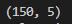
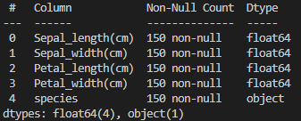
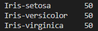
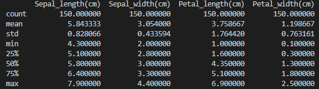
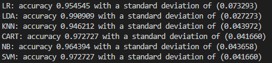

# pands-project2021 - Iris Dataset

# Author : Michelle O'Connor

 Programs to be installed  

# Contents

0.0 Project Outline  

1.0 Introduction   
 - 1.1 History of Iris Dataset
 - 1.2 Use of Iris Dataset

2.0 Loading and understanding the Iris dataset  
 - 2.1 Loading the dataset   
 - 2.2 Understanding the dataset  

3.0 Data Visualisation   
 - 3.1 Histograms   
 - 3.2 Boxplots   
 - 3.3 Scatterplot  

4.0    

6.0 Conclusion  

# 0.0 Project Outline  

The 2021 Programming and Scripting project is based on the well-known Fisher's Iris Dataset.  
The project task was to investigate, analyse and present my findings on the dataset using python. 

# 1.0 Introduction

## 1.1 History of Iris Dataset  

The Iris flower data set or Fisher's Iris data set is a multivariate data set introduced by the British statistician, eugenicist, and biologist Ronald Fisher in his 1936 paper **__The use of multiple measurements in taxonomic problems__** as an example of linear discriminant analysis. It is sometimes called Anderson's Iris data set because Edgar Anderson collected the data to quantify the morphologic variation of Iris flowers of three related species.     

The Iris dataset consists of the following:

50 samples of 3 different species (total 150 samples):  
    1.Iris setosa   
    2.Iris Virginica  
    3.Iris Veriscolor  

4 variables were measured:    
    1.Length of sepals (cm)  
    2.Width of sepals (cm)   
    3.Length of petals (cm)  
    4.Width of petals (cm)    

Two of the three species were collected in the Gaspé Peninsula "all from the same pasture, and picked on the same day and measured at the same time by the same person with the same apparatus"    

  

## 1.2 Use of Iris Dataset 

Why is the Iris dataset so well know, this dataset is the “hello world” of Machine Learning.
“Hello World” is often the first program written by people learning to code, the iris dataset is generally the first dataset used as an introduction into Machine Learning.   

Based on the combination of the features (Sepal Lenght, Sepal Width, Petal Length, Petal Width), Fisher developed a linear discriminant model to distinguish the species from each other based on the morphology of their flowers.  

This discriminant function performed well in discriminating between these species, except some overlap between Iris versicolor and Iris virginica. 
The Iris setosa is noticeably different from the other two species. 

Therefore the dataset is often used in data mining, classification and clustering examples and to test algorithms.
 

References

https://www.ritchieng.com/machine-learning-iris-dataset/
https://en.wikipedia.org/wiki/Iris_flower_data_set
https://towardsdatascience.com/the-iris-dataset-a-little-bit-of-history-and-biology-fb4812f5a7b5
http://www.lac.inpe.br/~rafael.santos/Docs/CAP394/WholeStory-Iris.html

Adding image to Github read me file  
https://www.youtube.com/watch?v=hHbWF1Bvgf4

# 2.0 Loading and understanding the Iris dataset:

## 2.1 Loading the dataset  
The Iris dataset is widely available on the internet. The dataset is included in R base and Python in the machine learning package Scikit-learn, so that users can access it without having to find a source for it.  

I am treating the iris dataset as a dataset that needs to be loaded so I use pandas to import the data from a csv file and create a dataframe.    
I rename the columns so that they include the measurement type 'cm' in the title and I rename the class column to species. 

    path = ""
    filenameForIrisData = path + "iris.csv"
    df = pd.read_csv(filenameForIrisData)
    iris_df = df.rename(columns = {"sepallength" : "Sepal_length(cm)", "sepalwidth" : "Sepal_width(cm)",   
    "petallength" : "Petal_length(cm)", "petalwidth" : "Petal_width(cm)", "class" : "species"})

## 2.2 Understanding the dataset    

The first part of investigating a dataset, starts with an initial understanding of the dataset.   

* I preview a sample of the data, for example the first 5 rows
    print(iris_df.head(5))     

       
  

This shows the dataset has 5 columns (Sepal Length, Sepal width, Petal Length, Petal Width, Species) and an unknown quantity of the rows.
I then build upon this to extract different views of the data:  

* Show the full size (shape) of the dataset.  
        We have 150 samples for the 5 columns    
    
        print(iris_df.shape)  

      

* Show the number of instances, the number of attributes and if any null values exist in the dataset.  
        We have 150 instances for 5 attributes of which no null values exist.    
    
        print(iris_df.info())

      

* Show how many instances the dataset contains by species.  
        The dataset has an equal number of 50 instances for each species.  
           
        print(iris_df.groupby('species').size())   

      

* Show the basic statistical details of the dataframe (iris dataset).  
        This shows the count, mean, std, min, 25%, 50%, 75%, max infor for each attribute/feature. 
        
        print(iris_df.describe())
 
      

* Show the first 5 rows of each type of species

        print(iris_df[0:5])
        print(iris_df[50:55])
        print(iris_df[100:105])   

            

* Show the summary of each variable by the species  
        print(iris_df.groupby("species").describe())

        To extract this data into a newly created single text file, we need to make the output in a   
        string format using str. 

            with open(".\Variable_Summary.txt", "wt") as i:
            i.write(str(iris_df.groupby("species").describe()))

Summary of the intial findings show a dataset of 50 rows each for 3 different species of the Iris flower, with no null values in the dataset.  
The statisical details of the dataset show that the mean range from 5.84 on the sepal length down to 1.19 on the petal width.  
However when we run the summary by species, due to the variation on the length and width by species, the petal length and petal width might be the best indicators to differentiate the species.  

https://www.c-sharpcorner.com/article/a-first-machine-learning-project-in-python-with-iris-dataset/
https://www.c-sharpcorner.com/article/a-first-machine-learning-project-in-python-with-iris-dataset/
https://www.kaggle.com/adityabhat24/iris-data-analysis-and-machine-learning-python
https://towardsdatascience.com/how-to-use-groupby-and-aggregate-functions-in-pandas-for-quick-data-analysis-c19e7ea76367
https://www.geeksforgeeks.org/python-basics-of-pandas-using-iris-dataset/  

# 3.0 Data Visualisation 

With a basic understanding of the dataset, we move to data visualisation to help us compare and observe trends within the data.  

There are many visualation options within python using matplotlib and seaborn.    

## 3.1 Univariate Analysis  

Univariate analysis is the simplest form of analyzing data.   
“Uni” means “one”, so in other words your data has only one variable. It doesn’t deal with causes or relationships (unlike regression) and it’s major purpose is to describe; it takes data, summarizes that data and finds patterns in the data. 

### 3.1.1 Historgrams  

Histograms is a classic visualisation tool that show the distribution of the number of observations that fall within a bin.  

    sns.FacetGrid(iris_df,hue="species",height=5).map(sns.histplot,"Petal_length(cm)").add_legend()
    plt.savefig("Petal_Length.png")
    sns.FacetGrid(iris_df,hue="species",height=5).map(sns.histplot,"Petal_width(cm)").add_legend()
    plt.savefig("Petal_Width.png")
    sns.FacetGrid(iris_df,hue="species",height=5).map(sns.histplot,"Sepal_length(cm)").add_legend()
    plt.savefig("Sepal_Length.png")
    sns.FacetGrid(iris_df,hue="species",height=5).map(sns.histplot,"Sepal_width(cm)").add_legend()
    plt.savefig("Sepal_Width.png")
    plt.show()   

 
 
 
 

The outputting plots show that the petal length and petal width can be used to differeniate the species setosa from the other 2 species.    

### 3.1.2 Boxplot  

Boxplot show the range the individual attributes fall into, it represents the minimum, first quartile (25% or lower), median, third quartile (75% or upper) and maximum of the dataset.  
The box on the plot shows between the first (25%) and third quartile (75%) on the range. The horizontal line that goes through the box is the median.  
The top and bottom lines known as 'whiskers' extend from the ends of the box to the minimun and maximum value.    
Any data points past the whiskers (represented by a diamond) are considered as outliers.  

Using Seaborn we plot a Boxplot for each attribute (4 Boxplots in total). 
To show 4 Boxplots on the one output requires a 2 x 2 (2 columns and 2 rows), therefore subplot(2,2) is required.  
The 3rd value in the subplot indicates where on the output the plot is shown, as follows 1 - Top Left, 2 - Top Right, 3 - Bottom Left, 4 - Bottom Right, 
for example (2,2,3) would show on the bottom left of the output.  
On the plot the x axis is the species type, y axis is the attribute  

    plt.figure(figsize=(15,10)) = set the size of the boxplot 
    plt.subplot(2,2,1)    
    sns.boxplot(x='species',y='Sepal_length(cm)',data=iris_df)
    plt.subplot(2,2,2)    
    sns.boxplot(x='species',y='Sepal_width(cm)',data=iris_df)     
    plt.subplot(2,2,3)    
    sns.boxplot(x='species',y='Petal_length(cm)',data=iris_df)     
    plt.subplot(2,2,4)    
    sns.boxplot(x='species',y='Petal_width(cm)',data=iris_df)
    plt.savefig("Box_plot.png")
    plt.show()   

    

Analyising the box plots, the sepal length and sepal width data results are close, with some overlap between all 3 species.   
However similiar to the initial view of the dataset and the histograms, the box plots show us that for Iris Setosa the petal length and petal width is visually clearly different from the Veriscolor and Virginica.   
The Iris Setosa petal length and petal width attributes data do not overlap with the Veriscolor and Virginica  
 

### 3.1.3 Violinplot  

The Violinplot groups by species, similar to the boxplot it shows how the length and width vary according to the species.  
However the violinplot show the density of the results, the thinner part shows that there is less occurances whereas the fatter part conveys higher density or high occurences.  

The code for a Violinplot is similar to Boxplot, to have all showing on the one output requires a 2 x 2 (2 columns and 2 rows), therefore subplot(2,2) is required.   
The 3rd value in the subplot indicates where on the output the plot is shown, as follows 1 - Top Left, 2 - Top Right, 3 - Bottom Left, 4 - Bottom Right.  
On the plot the x axis is the species type, y axis is the attribute 

    plt.figure(figsize=(15,10))
    plt.subplot(2,2,1)
    sns.violinplot(x='species',y='Petal_length(cm)',data=iris_df)
    plt.subplot(2,2,2)
    sns.violinplot(x='species',y='Petal_width(cm)',data=iris_df)
    plt.subplot(2,2,3)
    sns.violinplot(x='species',y='Sepal_length(cm)',data=iris_df)
    plt.subplot(2,2,4)
    sns.violinplot(x='species',y='Sepal_width(cm)',data=iris_df)
    plt.show()  

Summary of Univariate analysis, shows for the Iris Setosa the petal length and petal width is visually clearly different from the Veriscolor and Virginica.  

   

## 3.2 Multivariate analysis   

Multivariate analysis helps us understand the relationships between attributes & species better, i.e. which attributes contributes a lot in classifying species.  

### 3.2.1 Scatterplot (Pairsplot)  

Scatter plot is very useful to analyse the relationship between 2 features on x and y axis.
In seaborn library there is a pairplot function which is very useful to scatter plot all the features at once instead of plotting them individually.  

The pair plot is used to figure out a distribution of single variables and the relationship between two variables.  
If the pair plot is given a solution for that as a clear understanding of each flower sets at a single graph.  
Each flower scatters plots represented in different colors.  

For each pair of attributes, we can use a scatter plot to visualize their joint distribution  
    sns.pairplot(iris_df, hue="species", diag_kind="kde")  
    plt.show()  

The plot shows that the Petal length and Petal width are the most effective features to identify the different species of Iris. While Setosa can be easily linearly separable, Virnica and Versicolor have some overlap. So we can separate them by a line and some “if-else” conditions.

### 3.2.2 Correlation and Heatmaps  

A Heatmap is used to show correlation. Each square shows the correlation between the variables on each axis.   
Correlation ranges from -1 to +1. Values closer to zero means there is no linear trend between the two variables.    
The close to 1 the correlation is the more positively correlated they are; that is as one increases so does the other and the closer to 1 the stronger this relationship is.    
A correlation closer to -1 is similar, but instead of both increasing one variable will decrease as the other increases. 

As I plan is to use and train algorithms, the number of features and their correlation plays an important role for this.  
If there are features that are highly correlated, then training an algorithm with all the features will reduce the accuracy.   
Therefore features selection needs to be done carefully. The iris dataset has a low number of featues (4) but still we will see the correlation. 

Using the heatmap feature in Seaborn, we show the values on the heatmap, insert "annot = True" and use cmap to pick the colour palette of your choice  

    print(iris_df.corr())  

   

    plt.figure(figsize=(15,10))
    sns.heatmap(iris_df.corr(), annot = True, cmap = 'rocket') 
    plt.show()

   

 
   
The diagonals are all 1 (light in colour) because those squares are correlating each variable to itself (so it's a perfect correlation).  
High positive or negative value shows that the features have high correlation, in the iris dataset the petal length and petal width have the highest correlation with a value of 0.96.    
On the opposite end, the sepal width and the sepal length have the lowest correlation with a value of -0.11.

https://stackabuse.com/ultimate-guide-to-heatmaps-in-seaborn-with-python/  
https://www.kaggle.com/ash316/ml-from-scratch-with-iris  
http://www.cse.msu.edu/~ptan/dmbook/tutorials/tutorial3/tutorial3.html
https://www.c-sharpcorner.com/article/a-first-machine-learning-project-in-python-with-iris-dataset/    
https://medium.com/@avulurivenkatasaireddy/exploratory-data-analysis-of-iris-data-set-using-python-823e54110d2d
https://www.kaggle.com/dhruvmak/iris-flower-classification-with-eda  
https://stats.stackexchange.com/questions/392517/how-can-one-interpret-a-heat-map-plot  

# 4.0 Train and Validate the data (Machine learning)  

The Iris dataset can be used by a machine learning model to illustrate classification (a method used to determine the type of an object by comparison with similar objects that have previously been categorised).   
Once trained on known data, the machine learning model can make a predictive classification by comparing a test object to the output of its training data.

Steps To Be followed When Applying an Algorithm.  
1. Split the dataset into training and testing dataset.  
2. The testing dataset is generally smaller than training one as it will help in training the model better. I have chosen a 75%:25% training:testing split.  
3. Select an algorithm based on the problem (classification or regression). 
4. Pass the training dataset to the algorithm to train it, use the .fit() method.  
5. Then pass the testing data to the trained algorithm to predict the outcome, use the .predict() method.  
6. Check the accuracy by passing the predicted outcome and the actual output to the model.
7. Check against other algorithms.  
8. Final model selection.  

~ Make note that am using the sklearn.datasets import load_iris

The preliminary step is to define the attributes or input group (i.e. 4 features sepal length, sepal width, petal length, petal width) as X=iris.data and define the target or output group (species) as y=iris.target.    

    X=iris.data
    y=iris.target

**Step 1 - Split the Datset**  
My first step was to split the dataset into training and testing dataset, I have chosen a 75%:25% split:
75% of the data will be training data - X_train, y_train for training the model
25% of the data will be testing data - X_test, y_test for testing the model     

    from sklearn.model_selection import train_test_split
    X_train,X_test,y_train,y_test=train_test_split(X,y,test_size=0.25)

**Step 2 - Training and Testing Dataset shape**   
To show the shape/size of the train and test data samples
X_train is 75% of 150 = 112 rows of data in 4 columns (the 4 features/variables)
y_train is 75% of 150 = 112 rows of the species column
X_train is 25% of 150 = 38 rows of data in 4 columns (the 4 features/variables)
y_train is 25% of 150 = 38 rows of the species column   

    print("X_train shape: {}".format(X_train.shape))
    print("y_train shape: {}".format(y_train.shape))
    print("X_test shape: {}".format(X_test.shape))
    print("y_test shape: {}".format(y_test.shape))     

   

**Step 3 - Select an algorithm**   
I have chosen the k-nearest neighbours (knn) classifier as the algorithm to make a prediction of the species for sample data of one new data point.   
k is the number of nearest neighbours and is the core deciding factor. K is set by the user, we can consider any fixed number k of neighbors in the training.   
The algorithm calculates the distance between the new data point with the training examples.  
The model picks 'k' (as determined by the user) entries in the training data which are closest to the new data point and then is does a majority vote, that is it takes the most common species among those 'k' entries to be the class of the new data point.   
When k=1, the algorithm is know as the nearest neighbour algorithm.    
We can now make a prediction using the majority class among them. For our example, we will use one neighbor (k=1). 

**Step 4 - Pass the training set to the algorithm** 

I now use the fit method of the knn object, to train the algorithm with the training data X_train (containing the training data of the 4 features) and the training output y_train (containing the corresponding species), this builds up our model on the training set.  
We enter sample data (X_new) and show the shape of the data, it is one row (1 sample) with 4 columns of data (the 4 features/variables sepal and petal measurements).   

    knn = KNeighborsClassifier(n_neighbors=1)  
    knn.fit(X_train, y_train)  
    X_new = np.array([[5, 2.9, 1, 0.2]])  
    print("X_new.shape: {}".format(X_new.shape))     

   

**Step 5 - Predict Species**   

I now use the predict method of the knn object to predict the species of the sample data X_new and print the outcome. In the iris dataset, it has a species class of 0, also know as the setosa. 

    prediction = knn.predict(X_new)
    print("Prediction: {}".format(prediction))
    print("Predicted target name: {}".format(iris['target_names'][prediction]))    

   

**Step 6 - Check model accuracy** 

A question that remains is how can we trust the results of the model.  

The test data that was created was not used to build the model, but we do know the correct species for each iris in the test set.   
Therefore, we can make a prediction for each iris in the test data and compare it against its species, so we can know if the model is correctly predicting the species for a given flower.  
To measure how well the model works, we can obtain the accuracy of the number of flowers for which the right species was predicted.  

Using the X_test data containing the testing data (25% of the dataset) of the 4 features, I print out the prediction of the species using only the 4 features.  
And then compare the prediction of the species 'y_pred' to the actual species 'y_test'.   

    y_pred = knn.predict(X_test)
    print("Test set predictions:\n {}".format(y_pred))
    print("Test set score (np.mean): {:.2f}".format(np.mean(y_pred == y_test)))  

 

Another way to do this would be to use the score method of the knn object, which will compute the test set accuracy 

    print("Test set score (knn.score): {:.2f}".format(knn.score(X_test, y_test)))  

   

For this model, the accuracy on the test set is 0.97, which means the model made the right prediction for 97% of the irises in the given dataset,  
We can expect the model to be correct 97% of the time for predicting the species of new irises.  
This is a high level of accuracy and it means that our model may be trustworthy enough to use.  

While the iris dataset and classification is simple, it is a good example to illustrate how a machine learning problem should be approached and how useful the outcome can be. 

**Step 7 - Compare to other algorithms**   

An additional step that can be done is to spot check other algorithms to see their results. 
I will test 6 different algorithms, this is a good mixture of simple linear (LR and LDA), nonlinear (KNN, CART, NB and SVM) algorithms.  

    models = []
    models.append(('LR', LogisticRegression(solver='liblinear', multi_class='ovr')))
    models.append(('LDA', LinearDiscriminantAnalysis()))
    models.append(('KNN', KNeighborsClassifier()))
    models.append(('CART', DecisionTreeClassifier()))
    models.append(('NB', GaussianNB()))
    models.append(('SVM', SVC(gamma='auto')))

NOTE NOTE NOTE evaluate each model in turn insert notes  

    results = []
    names = []
    for name, model in models:
        kfold = StratifiedKFold(n_splits=10, random_state=1, shuffle=True)
        cv_results = cross_val_score(model, X_train, y_train, cv=kfold, scoring='accuracy')
        results.append(cv_results)
        names.append(name)
        print('%s: %f (%f)' % (name, cv_results.mean(), cv_results.std()))  

   

We can also create a plot of the model evaluation results and compare the spread and the mean accuracy of each model.  
A useful way to compare the samples of results for each algorithm is to create a box and whisker plot for each distribution and compare the distributions.

    plt.boxplot(results, labels=names)
    plt.title('Algorithm Comparison')
    plt.show()    

   

We can see that the box and whisker plots are squashed at the top of the range, with many evaluations achieving 100% accuracy, and some pushing down into the high 80% accuracies.  

NOTE NOTE NOTE Make predictions on test/validation dataset 

**Step 8 - Final model selection**    

The results in the previous section suggest that the LDA was the most accurate model, I will use this model as the final model.  
Now we want to get an idea of the accuracy of the model on our validation set.  
This will give us an independent final check on the accuracy of the best model.  

I can fit the model on the entire training dataset and make predictions on the testing dataset.
    model = LinearDiscriminantAnalysis()
    model.fit(X_train, y_train)
    predictions = model.predict(X_test)

We can evaluate the predictions by comparing them to the expected results in the testing set and then calculate classification accuracy, as well as a confusion matrix and a classification report.  

    print(accuracy_score(y_test, predictions))
    print(confusion_matrix(y_test, predictions))
    print(classification_report(y_test, predictions))    

   

We can see that the accuracy is 1.0 or about 100% on the hold out dataset. The confusion matrix provides an indication of the errors made.
Finally, the classification report provides a breakdown of each class by precision, recall, f1-score and support showing excellent results (granted the validation dataset was small).  

https://medium.com/gft-engineering/start-to-learn-machine-learning-with-the-iris-flower-classification-challenge-4859a920e5e3
https://machinelearningmastery.com/machine-learning-in-python-step-by-step/
https://machinelearningmastery.com/make-predictions-scikit-learn/

https://kedro.readthedocs.io/en/stable/02_get_started/05_example_project.html
